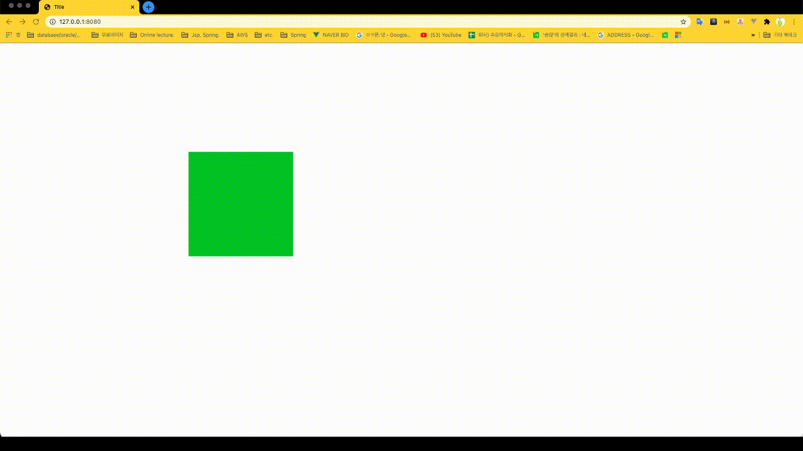

# interactive_web => DragBox

> Create canvas Drag and Drop box

## install
``` bash
# step 1: install dependencies
npm install

# step2: Run http-serve module
http-serve

# step 3 : input browser Url (location:8080/index.html)
```

## Example picture 1


